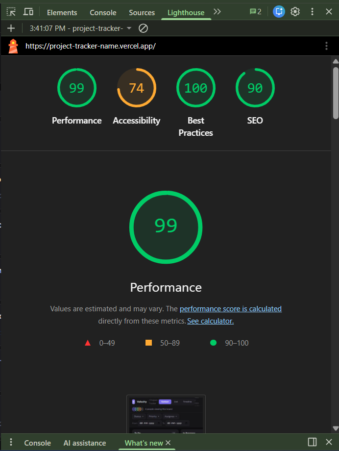

# Velozity — Multi-View Project Tracker

A fully functional project management UI built with React, TypeScript, and Zustand. Features a custom drag-and-drop system, virtual scrolling, three switchable views, live collaboration indicators, and URL-synced filters.

## Live Demo

[https://project-tracker-name.vercel.app](https://project-tracker-name.vercel.app)

## Setup Instructions

**Requirements:** Node.js 18+

```bash
# 1. Clone the repository
git clone https://github.com/yourusername/project-tracker.git
cd project-tracker

# 2. Install dependencies
npm install

# 3. Start development server
npm run dev

# 4. Open http://localhost:5173
```

**Build for production:**
```bash
npm run build
npm run preview
```

---

## State Management — Why Zustand

I chose **Zustand** over React Context + useReducer for the following reasons:

1. **No boilerplate** — Zustand stores are plain functions. With 500 tasks mutating across drag-and-drop, filter changes, and inline status edits, Context would require deeply nested reducers and action types that add complexity without benefit.

2. **Selective subscriptions** — Components subscribe only to the slices they need. The KanbanView only re-renders when `tasks` changes, not when `view` or `filters` change. With Context, any state change re-renders all consumers.

3. **Direct mutations** — `updateTaskStatus` mutates a single task without spreading the entire array through a reducer. This keeps the update logic readable and co-located.

4. **Performance at scale** — With 500 tasks, avoiding unnecessary re-renders is important. Zustand's granular subscriptions outperform Context at this data size.

---

## Virtual Scrolling Implementation

Virtual scrolling is implemented from scratch in `src/components/ListView.tsx` with no external libraries.

**How it works:**

- Every row has a fixed height of `ROW_HEIGHT = 44px`
- The scroll container has `overflow-y: auto` and listens to `onScroll`
- An inner div is sized to `totalRows × ROW_HEIGHT` to create the correct scrollbar height
- On each scroll event, we calculate:
  ```
  startIndex = Math.floor(scrollTop / ROW_HEIGHT) - BUFFER
  endIndex   = startIndex + visibleCount + BUFFER * 2
  ```
- Only rows between `startIndex` and `endIndex` are rendered into the DOM
- Each rendered row is `position: absolute` with `top = index × ROW_HEIGHT`
- A buffer of 5 rows above and below the viewport prevents blank flashes during fast scrolling

**Result:** With 500 tasks, only ~20–25 DOM nodes are active at any time regardless of scroll position. Scrolling is smooth with no flickering or blank gaps.

---

## Drag-and-Drop Implementation

Custom drag-and-drop is implemented in `src/components/KanbanView.tsx` using **Pointer Events** (not the HTML5 Drag API), which gives native support for both mouse and touch devices.

**How it works:**

1. `onPointerDown` — captures pointer on the card element using `setPointerCapture`. Records the task, its origin column, and the cursor offset from the card's top-left corner.

2. `onPointerMove` (on container) — updates ghost card position using `clientX / clientY` minus the recorded offset.

3. `onPointerEnter / onPointerLeave` (on each column) — tracks which column the cursor is currently over (`dragOverCol` state). Columns highlight with a subtle purple tint on hover.

4. `onPointerUp` (on container) — if `dragOverCol` differs from the origin column, calls `updateTaskStatus`. Clears all drag state.

**Placeholder:** The original card slot remains in the DOM but renders with `opacity: 0.3` and a dashed border instead of disappearing — this prevents layout shift in the column.

**Ghost card:** A `position: fixed` div follows the cursor with a slight rotation and drop shadow, rendered only while dragging. It uses `pointerEvents: none` so it doesn't interfere with drop target detection.

**Snap back:** If `onPointerUp` fires with no valid `dragOverCol` (dropped outside any column), drag state clears and the card returns to its original position instantly with no status change.

---

## Lighthouse Score

Desktop score: **99**

> To reproduce: Open the deployed Vercel URL in Chrome → F12 → Lighthouse tab → Desktop → Analyze page load



<!-- IMPORTANT: After deploying to Vercel, run Lighthouse on the live URL,
     save the screenshot as lighthouse.png in the project root, then push to GitHub -->

---

## Explanation (150–250 words)

The hardest UI problem was implementing the drag placeholder without causing layout shift in the Kanban columns. The naive approach — removing the card from the DOM while dragging — collapses the column height and causes every card below to jump up. Instead, I keep the card in the DOM at all times but toggle its visual state: when dragging, the card renders as a transparent dashed box with the same height as a normal card. This means the column layout never changes during a drag — only the card's appearance does.

The ghost element that follows the cursor is a completely separate `position: fixed` div rendered in the same component, not the card itself. This separation means the column retains its placeholder while the cursor carries a visual copy of the card.

For the pointer events approach specifically, `setPointerCapture` was essential — without it, fast mouse movement causes the pointer to leave the card element before `pointermove` fires, breaking tracking. Capturing the pointer ensures all subsequent events are delivered to the card's parent container regardless of cursor speed.

With more time, I would refactor the Zustand store to use Immer for immutable updates, which would make the `updateTaskStatus` and future bulk-edit operations cleaner and less error-prone when the task shape grows more complex.

---

## Project Structure

```
src/
├── components/
│   ├── Avatar.tsx          # Initials-based avatar
│   ├── CollabBar.tsx       # Live viewers indicator bar
│   ├── FilterBar.tsx       # Multi-select filter controls
│   ├── KanbanView.tsx      # Kanban board + custom DnD
│   ├── ListView.tsx        # Virtual scrolling list
│   ├── PriorityBadge.tsx   # Colour-coded priority pill
│   └── TimelineView.tsx    # Gantt / timeline view
├── data/
│   └── seed.ts             # 500-task generator + constants
├── hooks/
│   └── useCollab.ts        # Simulated collaboration hook
├── store/
│   └── taskStore.ts        # Zustand store
├── types/
│   └── index.ts            # TypeScript interfaces
├── utils/
│   └── index.ts            # Date helpers, initials
├── App.tsx
├── main.tsx
└── index.css
```
